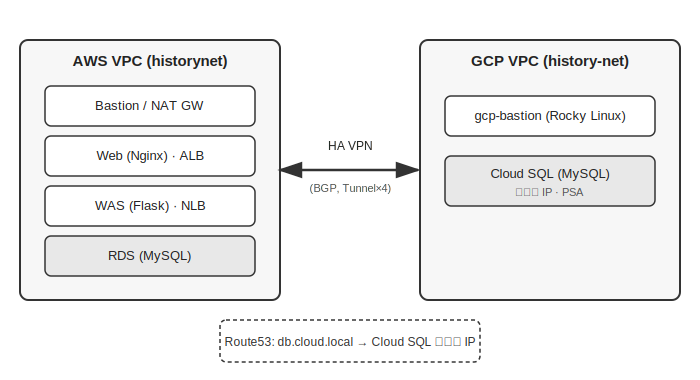
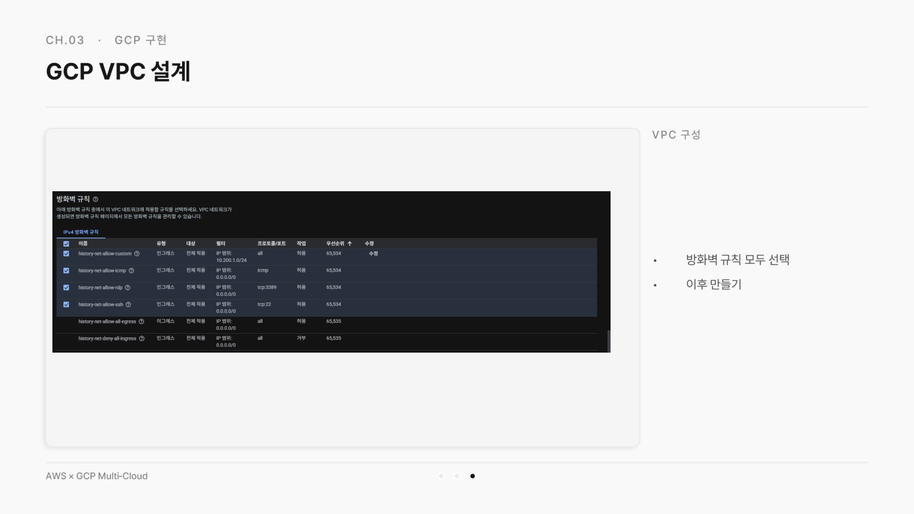
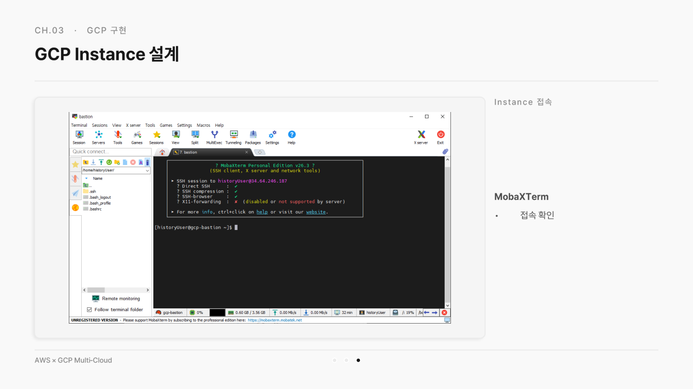
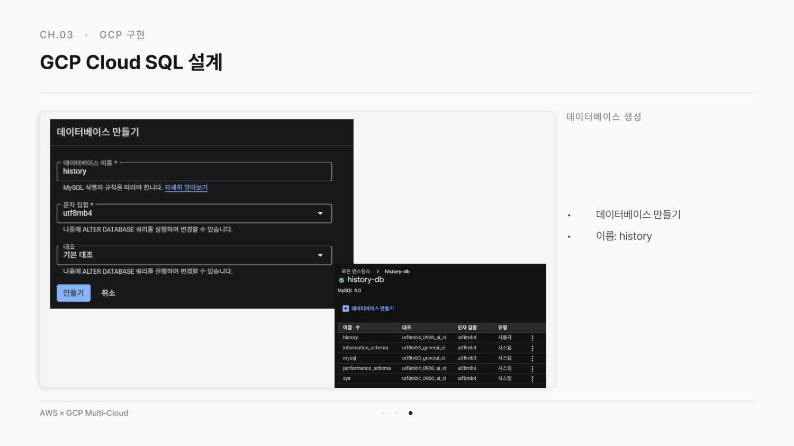
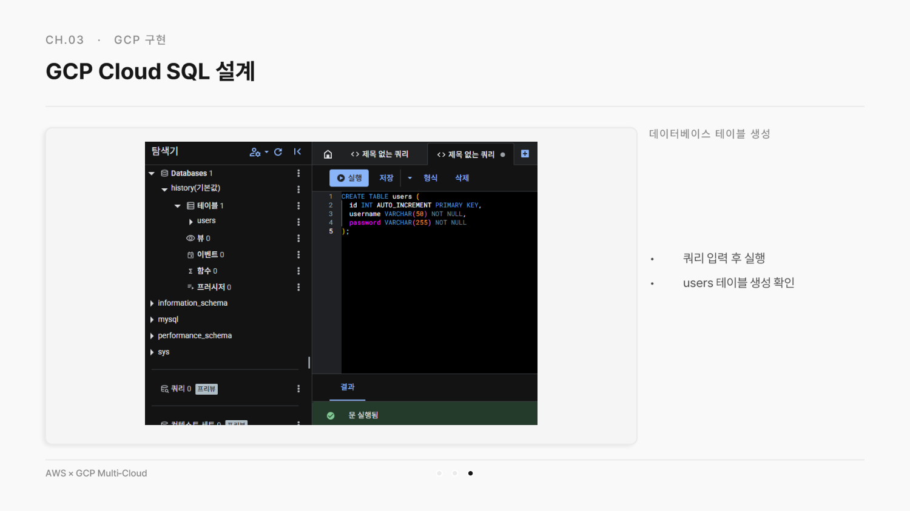
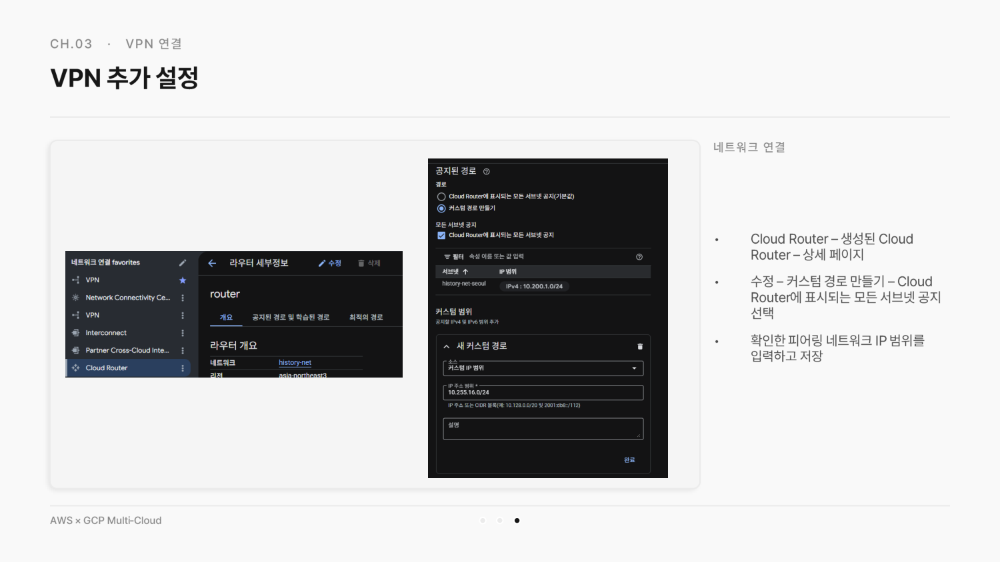

# AWS × GCP 멀티클라우드 구성

개인 실습으로 AWS(Terraform 기반 3-Tier 웹 서비스)와 GCP를 HA VPN으로 연결하는 멀티클라우드 구성 전체를 먼저 진행했고, 이후 4인 팀 프로젝트에서는 GCP 측 인프라(VPC·Compute Engine·Cloud SQL) 구축을 담당했습니다.

---

## Architecture

AWS VPC(historynet)의 3-Tier 웹 서비스(Web-Nginx, WAS-Flask, RDS)와 GCP VPC(history-net)의 Cloud SQL을 HA VPN(BGP, 터널 4개)으로 연결한 구조입니다. 애플리케이션은 `db.cloud.local`이라는 사설 도메인으로 Cloud SQL에 접근하며, Route53에서 이 도메인을 Cloud SQL의 비공개 IP로 해석합니다.

---

## Tech Stack

`GCP Compute Engine` `Cloud SQL (MySQL)` `VPC` `AWS`

---

## 담당 역할

4인 팀 프로젝트에서는 **GCP 측 인프라 구축**을 담당했습니다.

- GCP VPC(history-net) 및 서브넷(history-net-seoul, 10.200.1.0/24) 설계, 방화벽 규칙 구성
- Compute Engine 기반 Bastion 서버(gcp-bastion, Rocky Linux) 구축 및 SSH 키 설정
- Cloud SQL(MySQL 8.0) 인스턴스 설계, 비공개 서비스 액세스(PSA)로 AWS와 연결되는 데이터베이스 구성
- 데이터베이스·사용자 계정 생성 및 접속 검증

VPN·BGP 연결(Cloud Router, HA VPN Gateway, VPN 터널 4개 구성)은 팀원이 담당했습니다.

---

## 구현 내용 (개인 실습)

- AWS 측: VPC(historynet, 10.0.0.0/16) 8개 서브넷(Public/Web/WAS/DB × 2AZ), Terraform으로 EC2 5대(Bastion, Web a/b, WAS a/b), RDS(MySQL), ALB·NLB 구축
- GCP 측: VPC(history-net), Compute Engine Bastion, Cloud SQL(MySQL) 구축
- 두 VPC를 HA VPN(BGP, ASN 65000↔64512, 터널 4개 풀메시)으로 연결
- Route53에 `db.cloud.local` CNAME을 A 레코드로 변경해 Cloud SQL 비공개 IP로 직접 연결
- AWS Bastion에서 `mysql -h db.cloud.local`로 GCP Cloud SQL 접속 성공까지 확인

---

## 검증 결과

### GCP VPC 방화벽 규칙 구성

### GCP Bastion 인스턴스 SSH 접속 확인

### Cloud SQL 데이터베이스 생성

### Cloud SQL 테이블 생성 쿼리 실행

### AWS에서 GCP Cloud SQL 접속 성공 (팀 최종 검증)

---

## 발표 자료

[프로젝트 발표 자료 보기](https://github.com/gyu2001/aws-gcp-multicloud/blob/main/aws-gcp-multicloud.pdf)

> 위 자료는 4인 팀이 함께 진행한 프로젝트 전체 내용을 담고 있습니다. 본인이 실제로 담당한 범위는 위 "담당 역할" 기준으로 확인하실 수 있습니다.
